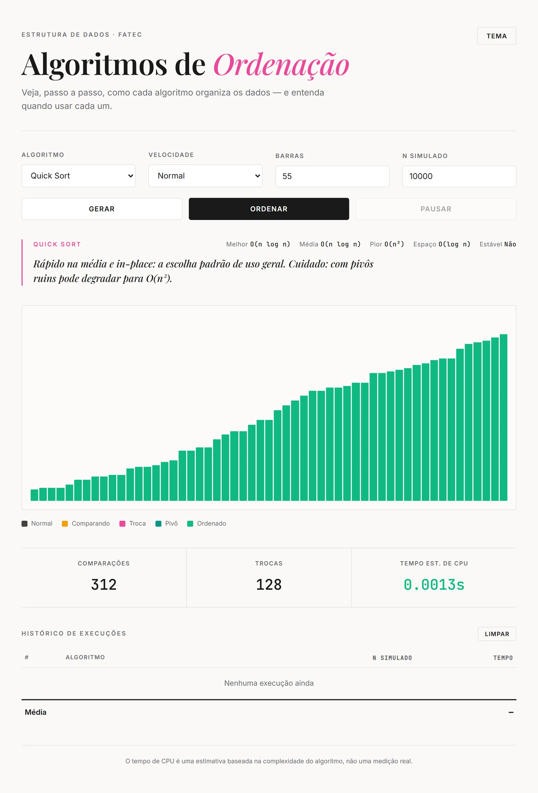

# Visualizador de Algoritmos de Ordenação

Aplicação web interativa que anima, passo a passo, o funcionamento dos principais algoritmos de ordenação. Feita com JavaScript puro (sem frameworks), HTML e CSS.

Projeto desenvolvido para a disciplina de Estrutura de Dados (FATEC).

## Demo

Acesse ao vivo: https://antonio0ca.github.io/Visualizador-de-algoritmos/



## Funcionalidades

- Sete algoritmos de ordenação animados (ver tabela abaixo).
- Controle de velocidade e quantidade de barras.
- Pausar e continuar a animação a qualquer momento.
- Legenda de cores para cada estado das barras: comparando, troca, pivô e ordenado.
- Painel de complexidade (Big-O) por algoritmo: melhor caso, caso médio, pior caso, espaço e estabilidade.
- Estimativa de tempo de CPU para um N grande, projetada a partir da complexidade.
- Histórico de execuções, destacando a mais rápida e a mais lenta.
- Tema claro e escuro (preferência salva no navegador).

## Algoritmos

| Algoritmo | Melhor | Média | Pior | Espaço | Estável |
|---|---|---|---|---|---|
| Bubble Sort | O(n) | O(n^2) | O(n^2) | O(1) | Sim |
| Selection Sort | O(n^2) | O(n^2) | O(n^2) | O(1) | Não |
| Insertion Sort | O(n) | O(n^2) | O(n^2) | O(1) | Sim |
| Shell Sort | O(n log n) | O(n^1.25) | O(n^2) | O(1) | Não |
| Merge Sort | O(n log n) | O(n log n) | O(n log n) | O(n) | Sim |
| Quick Sort | O(n log n) | O(n log n) | O(n^2) | O(log n) | Não |
| Heap Sort | O(n log n) | O(n log n) | O(n log n) | O(1) | Não |

## Como rodar localmente

Por ser um site estático, basta servir a pasta:

```bash
npx serve .
```

Ou abrir o arquivo `index.html` diretamente no navegador.

## Tecnologias

JavaScript (vanilla), HTML5 e CSS3. Sem dependências nem etapa de build.

## Observação

O "Tempo est. de CPU" é uma estimativa baseada na complexidade do algoritmo e em um fator de variação, não uma medição real de execução. Serve para ilustrar a diferença de escala entre os algoritmos conforme o N cresce.
